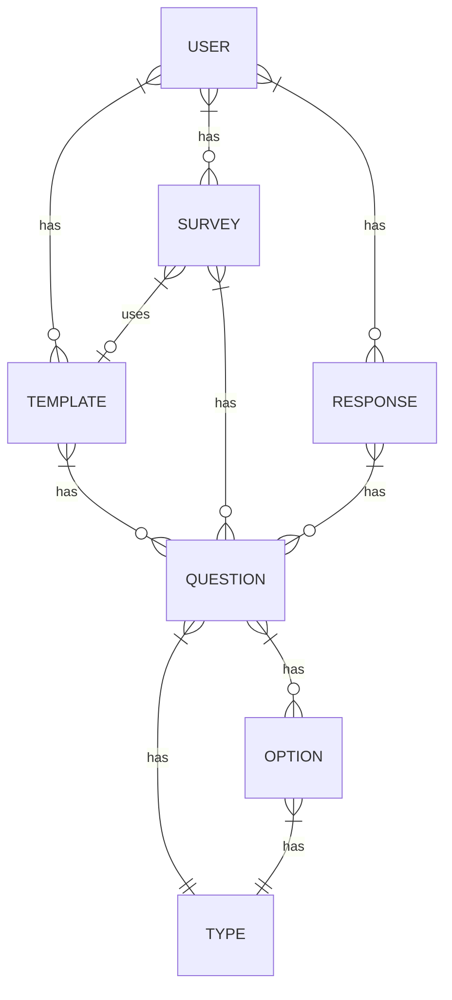
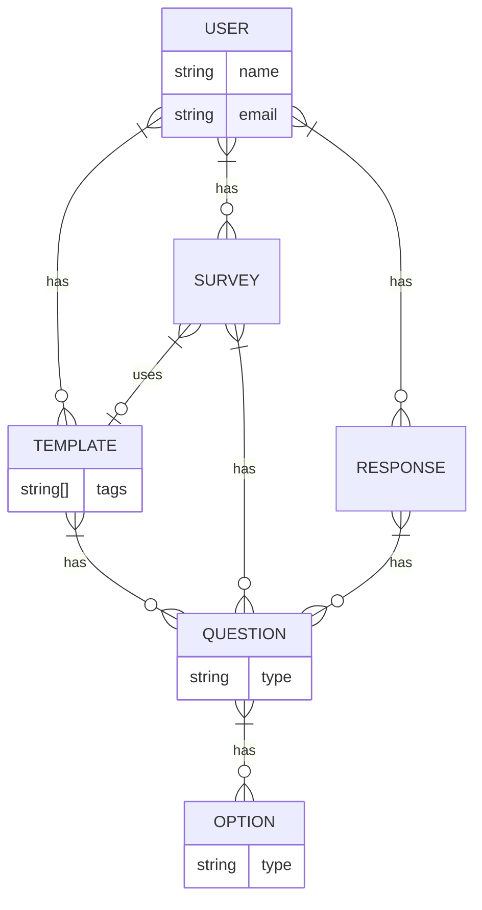

# Survey Maker

## Intro
A survey template creator and survey builder web application so that employees can create their own survey templates and create surveys from those templates while being able to manage the responses of those surveys.

## Purpose
Currently if a survey needs to be created it has to be created through SQL queries on the database and that is just not sustainable and they need a much better user experience. This apporach will be much more user friendly. 

## Features

#### Must Have
- Ability to create, edit, and delete survey templates
- Ability to create, edit, and delete surveys from the survey templates or from a blank template
- Ability to login to manage surveys and templates
- Ability to save drafts of the survey templates, surveys, and survey responses
- Ability to submit survey
- Ability to pick from several question types when adding a question to a survey template or survey
- Ability to set a survey type to a survey template
- Ability to set survey tags to a survey template
- Ability to collect responses
- Ability to manage responses
  - started or completed
- Ability to have the following question types:
  - Short Answer
  - Paragraph Answer
  - Multiple choice
  - Checkboxes
  - Dropdown
  - Linear Scale
- Ability to have the following options for questions:
  - Required/Not required setting (default to required)
  - Duplicate
  - Delete

#### Should Have
- Ability to get metadata from surveys taken
- Ability to send out emails to request survey responses
- Ability to have the following question types:
  - File Upload
  - Date
  - Time
- Ability to have the following options for surveys/templates:
  - Anonymous or not
  - Public (publish) or private

#### Could Have
- Ability to publish survey templates for others to use
- Ability to automatically send out reminder emails to survey respondents that haven't completed it yet
- Ability to add emails to survey templates
- Ability to have the following optional additons to questions:
  - Image
  - Video
  - Sections or Title/Description to sets of questions

#### Wish List

## Domain Diagram

## ERD
